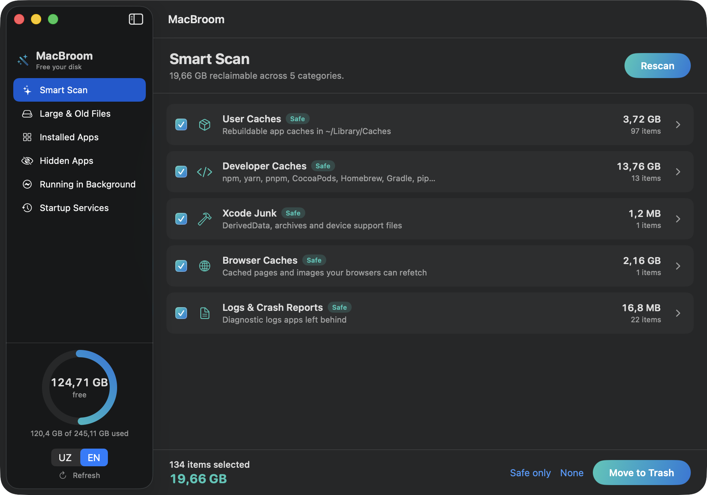
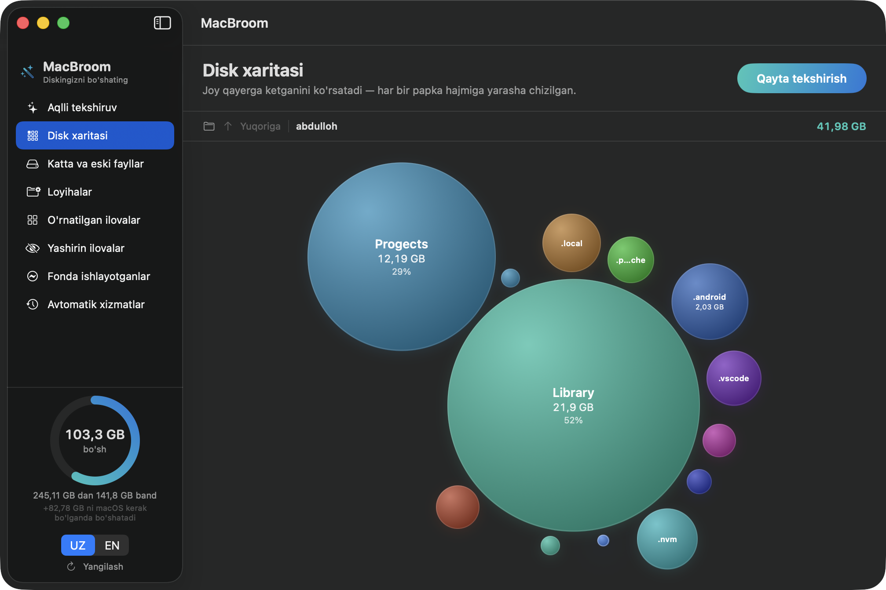
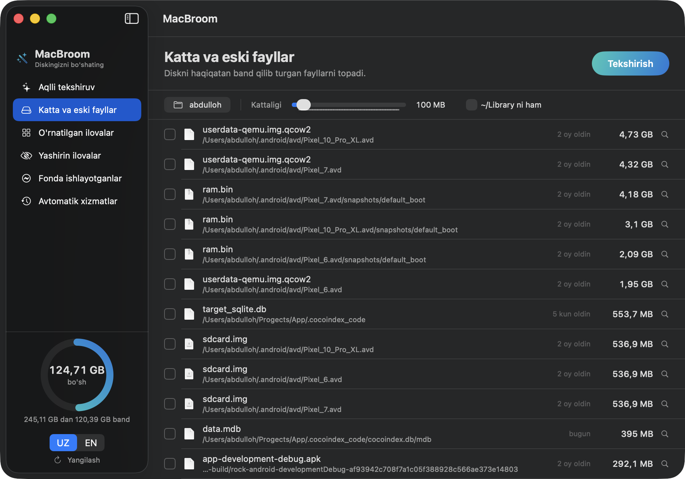
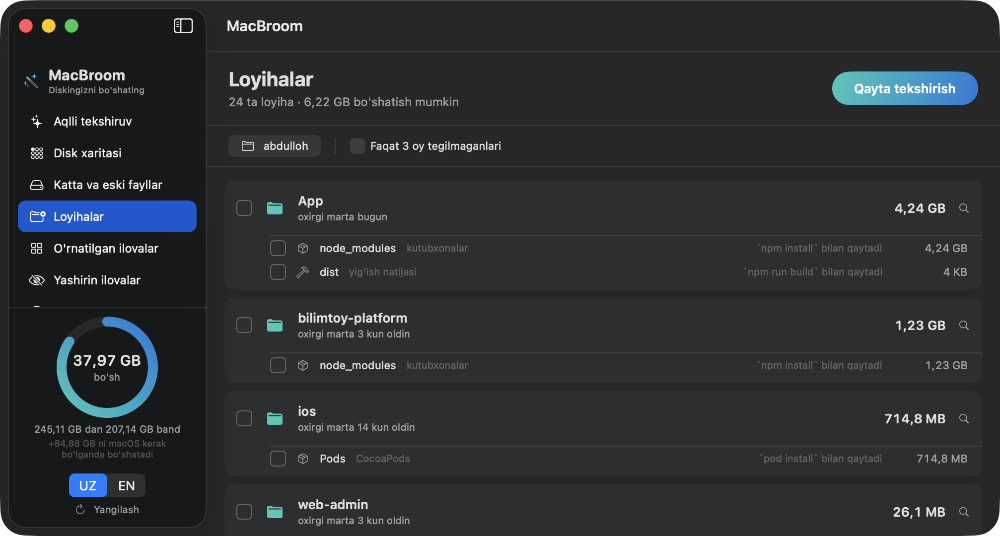
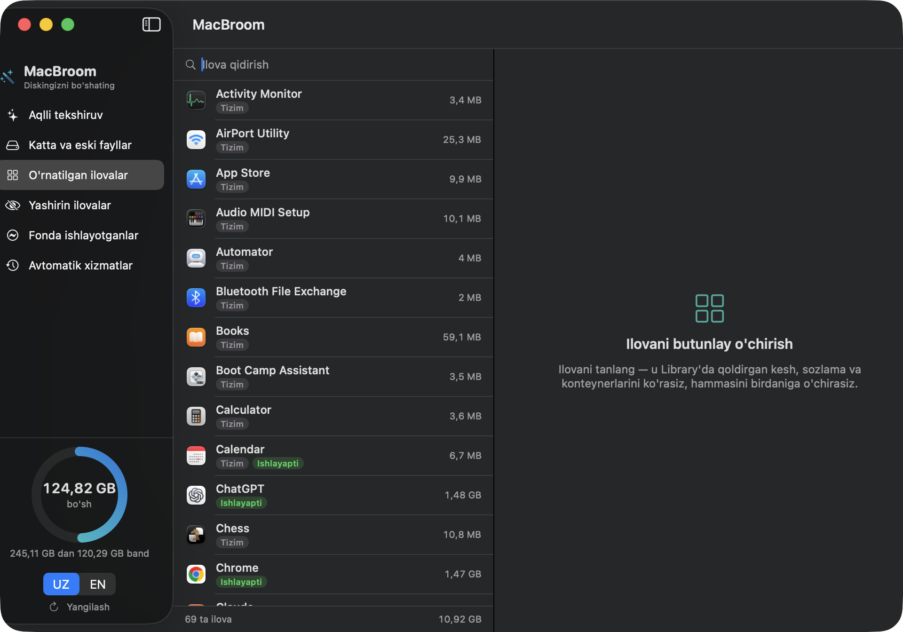
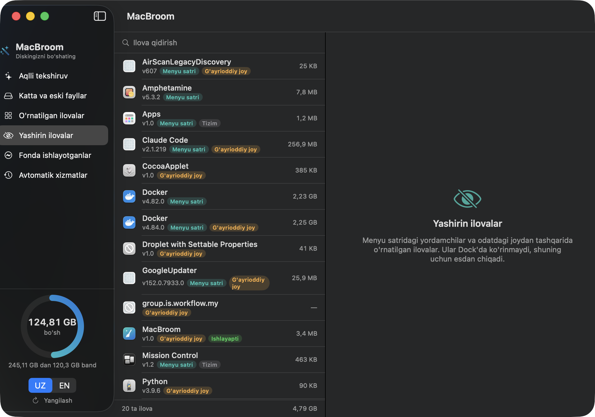
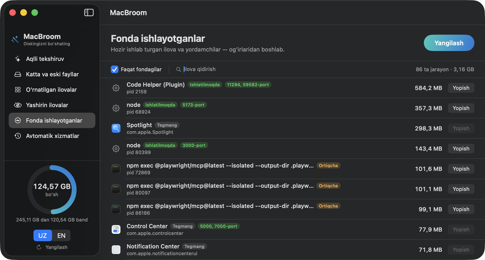
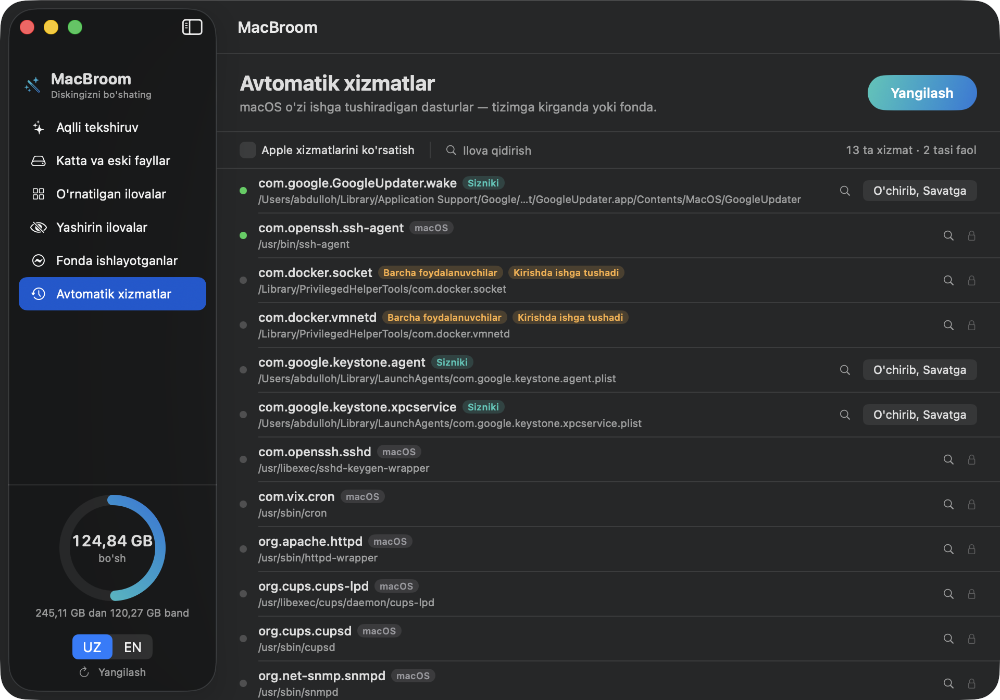

# MacBroom

**A free disk cleaner for macOS.** Finds caches and junk, uninstalls apps together
with the files they leave behind, and shows you what is actually filling your disk.

It does the core of what CleanMyMac does, but it is **free**, shows no ads, and
**never touches the network** — there is no networking code in it at all.

Swift + SwiftUI. Zero third-party dependencies. 3.8 MB.
The interface is available in **English and Uzbek**, switchable at runtime.

🇺🇿 [O'zbekcha](README.md) · 📖 [Full manual](document.md) (o'zbekcha)



---

## Contents

- [What it does](#what-it-does)
- [Install](#install)
- [First launch](#first-launch)
- [The screens](#the-screens)
- [Verdict badges](#verdict-badges)
- [Safety](#safety)
- [Terminal mode](#terminal-mode)
- [FAQ](#faq)
- [Contributing](#contributing)
- [Licence](#licence)

---

## What it does

| Screen                    | What it does                                                                                           |
| ------------------------- | ------------------------------------------------------------------------------------------------------ |
| **Smart Scan**            | Finds caches, logs, developer build junk, Trash and stale installers, and clears them in one pass      |
| **Disk Map**              | Draws every folder as a box sized to its contents — where the space went, at a glance                  |
| **Large & Old Files**     | Walks any folder for files above a size threshold, hidden folders included                             |
| **Developer Projects**    | `node_modules`, `build`, `Pods`, `.gradle` grouped per project, each with the command that restores it |
| **Installed Apps**        | Every app on the machine, plus an uninstaller that also removes what it left in `~/Library`            |
| **Hidden Apps**           | Menu-bar helpers and apps installed outside the usual places                                           |
| **Running in Background** | Live processes by memory footprint, with the TCP ports they hold                                       |
| **Startup Services**      | launchd agents and daemons that start on their own                                                     |

The rule underneath all of it: **nothing is ever deleted permanently**. Everything
goes to the Trash, so a mistake is one "Put Back" away.

---

## Install

### Requirements

- **macOS 13 (Ventura)** or newer
- **Xcode Command Line Tools** (Swift 5.9+)

If you do not have the command line tools yet:

```bash
xcode-select --install
```

### Build

```bash
git clone https://github.com/Abdulloh0109/macBroom.git
cd macBroom
./Scripts/build_app.sh release
open build/MacBroom.app
```

That is all of it — about **17 seconds** from a clean clone.

To generate the app icon as well (optional — the build works without it):

```bash
./Scripts/make_icon.swift .
```

### Keep it around

```bash
cp -R build/MacBroom.app /Applications/
```

---

## First launch

The bundle is **ad-hoc signed** — no $99/year Apple Developer account was involved —
so macOS may refuse the first launch:

> "MacBroom" cannot be opened because the developer cannot be verified.

To get past it:

1. **Right-click** `MacBroom.app`
2. Choose **Open**
3. Click **Open** again in the dialog

Once is enough; after that it opens normally.

**Language:** the **UZ / EN** switch sits at the bottom of the sidebar. The whole
interface changes immediately — no restart.

**Permissions:** macOS protects `~/Downloads`, `~/Desktop` and `~/Documents`. The app
asks the first time it wants to look inside. Decline and those folders are simply
skipped; nothing else breaks.

---

## The screens

### 1. Smart Scan

Press **Scan** and it goes through:

| Category         | Covers                                                                              |
| ---------------- | ----------------------------------------------------------------------------------- |
| User caches      | `~/Library/Caches` — files apps rebuild on their own                                |
| Developer caches | npm, yarn, pnpm, Bun, Deno, CocoaPods, Homebrew, pip, Gradle, Cargo, Go, `~/.cache` |
| Xcode junk       | DerivedData, archives, iOS/watchOS/tvOS device support, simulator caches            |
| Browser caches   | Chrome, Safari, Firefox, Brave, Edge, Arc                                           |
| Logs             | `~/Library/Logs`, crash reports                                                     |
| Mail downloads   | Attachments Mail.app copied out of messages                                         |
| Trash            | What is already in `~/.Trash`                                                       |
| Stale installers | `.dmg`/`.pkg`/`.iso`/`.zip` in `~/Downloads` older than 60 days                     |
| iOS backups      | Local iPhone/iPad backups                                                           |

A green **Safe** badge means the files come back by themselves. An amber **Check**
badge means it might be a backup or something you downloaded on purpose — those are
**never pre-selected**.

### 2. Disk Map



Answers "the disk is full, but what is filling it?" Each bubble's **area** is
proportional to the folder's size — twice the bytes, twice the area.

- **Click** a bubble to go inside, with a spring transition
- **Up**, or the breadcrumb, to come back
- **Right-click** to reveal in Finder
- Hovering lifts and brightens a bubble

A whole home folder (100k+ files) is measured in **~20 seconds**. The tree is built
in a single pass, so moving between boxes afterwards is instant.

### 3. Large & Old Files



Pick a folder and a size threshold; results stream in as they are found.

**Hidden folders are included**, which matters: the biggest files usually sit in
`~/.android` (emulator images), `~/.cache` or `~/.docker`, not in `~/Documents`.

### 4. Developer Projects



On a developer's machine `node_modules` is usually the single biggest thing. This
screen finds them across every project and groups them:

| Folder                                             | Comes back with                   |
| -------------------------------------------------- | --------------------------------- |
| `node_modules`                                     | `npm install`                     |
| `dist`, `build`, `out`, `.next`, `.nuxt`, `.turbo` | `npm run build`                   |
| `Pods`                                             | `pod install`                     |
| `.gradle`                                          | `./gradlew build`                 |
| `target`                                           | `cargo build`                     |
| `.venv`, `venv`, `__pycache__`                     | `pip install -r requirements.txt` |
| `vendor`                                           | `composer install`                |
| `DerivedData`                                      | Xcode rebuilds it                 |

**The safety rule:** a folder only counts when a project marker sits next to it —
`package.json`, `Cargo.toml`, `Podfile`, `go.mod` and friends. A plain
`~/Documents/build` of your own never shows up.

**Only untouched for 3 months** narrows the list to projects you have not worked on
in a while — the ones actually worth clearing.

### 5. Installed Apps



Every app with its size and version. Select one and you see everything it left in
`~/Library`: `Application Support`, `Caches`, `Preferences`, `Containers`,
`Group Containers`, `Saved Application State`, `HTTPStorages`, `WebKit`, `Logs`,
`Cookies`, `LaunchAgents`.

Dragging an app to the Trash the normal way **leaves all of that behind**, sometimes
for years. **Uninstall** takes the lot in one go — and you can untick individual
items if you plan to reinstall and want to keep your settings.

macOS system apps are shown with a lock and cannot be removed.

### 6. Hidden Apps



Apps with no Dock icon. Two kinds:

- **Menu bar** — helpers that live in the top-right corner (`LSUIElement`)
- **Unusual location** — installed outside `/Applications`

Why it matters: these are the apps you never notice. On one machine this found **two
copies of Docker** — 4.82.0 and 4.84.0, about 2.2 GB each. One was a leftover.

### 7. Running in Background



What is running right now, heaviest first.

- **Memory** matches Activity Monitor's "Memory" column (`phys_footprint`)
- **Port badge** — a process holding a port shows it in green, e.g. `port 5173`
- **Quit** asks nicely (`terminate` for apps, `SIGTERM` for bare executables). Never
  `SIGKILL`, so unsaved work survives

Worth knowing: a dev server started from a terminal — `npm run web`, `node`,
`python -m http.server` — is not an "application" as far as macOS is concerned and
would be invisible in the usual lists. MacBroom adds every port-holding process
explicitly.

### 8. Startup Services



Programs macOS launches on its own, at boot or at login (launchd agents and daemons).

| Kind          | Location                  | Status                          |
| ------------- | ------------------------- | ------------------------------- |
| **Yours**     | `~/Library/LaunchAgents`  | Can be turned off               |
| **All users** | `/Library/Launch*`        | Locked — needs an administrator |
| **macOS**     | `/System/Library/Launch*` | Locked — protected by macOS     |

A green dot means active. **Turn off & remove** runs `launchctl bootout` first, then
moves the `.plist` to the Trash.

This is usually where update checkers from Google, Adobe and Dropbox live — running
in the background all day, eating battery.

---

## Verdict badges

The app does not just list things, it says what it thinks you should do about each:

| Badge          | Meaning                                                               |
| -------------- | --------------------------------------------------------------------- |
| **Can remove** | Nothing is using it                                                   |
| **Left over**  | Whatever started this has already closed — the best thing to clear    |
| **In use**     | Something needs it right now (a held port, an open window) — leave it |
| **Keep**       | macOS needs it. Quitting gains nothing; it just starts again          |

On a **Keep** row the _Quit_ button is disabled outright, so there is no way to press
it by mistake.

In Smart Scan a cache folder may carry an amber **App is open** badge — you can still
remove it, but the app will simply write the cache again, so it is better to quit it
first.

---

## Safety

This is the part that matters in a tool that deletes things.

**1. Nothing is ever deleted permanently.** Every removal is `FileManager.trashItem`
— exactly what Finder's "Move to Trash" does. Emptying the Trash stays a separate,
manual act.

**2. Every path goes through the guard.**
[`SafetyGuard`](Sources/MacBroom/Core/SafetyGuard.swift) enforces:

- an allow-list of roots: your home folder and `/Applications`, nothing else
- a deny-list that must survive: `/`, `/System`, `/Library`, `~/Documents`,
  `~/Desktop`, `~/.ssh`, `~/Library/Caches` (the folder itself), and more
- a minimum depth, so a top-level directory can never be the target
- a symlink-escape check, so a link cannot point the tool outside its allowed roots

**3. Nothing moves until you confirm.** Items are listed with their sizes, then a
confirmation dialog appears.

**4. Risky categories are never pre-selected.** Backups and downloads are marked
_Check_ and left unticked.

**5. Overlaps cannot double-count.** `~/Library/Caches/Google/Chrome` and
`~/Library/Caches/Google` would otherwise be counted twice and collide on delete.

**6. Free space is the real number.** macOS's `…ForImportantUsage` capacity folds in
purgeable bytes and reported 122 GB free on a disk `df` said had 38 GB. The gauge
shows what is actually free and lists purgeable space separately.

**7. Processes and services get gentle treatment.** No `SIGKILL`; disabling a service
runs `launchctl bootout` and only ever touches `~/Library/LaunchAgents`.

Check the guard yourself — 31 assertions:

```bash
./build/MacBroom.app/Contents/MacOS/MacBroom --selftest
```

---

## Terminal mode

Read-only. It reports what the GUI would offer and removes nothing:

```bash
MacBroom --scan          # report in the saved language
MacBroom --scan --en     # force English
MacBroom --scan --uz     # force Uzbek
MacBroom --scan --json   # machine readable
MacBroom --map ~         # disk map as text, largest first
MacBroom --selftest      # SafetyGuard assertions
```

---

## FAQ

**How much will it free?**
On the machine it was built on, 19.6 GB on the first scan — mostly developer caches
(npm 5.9 GB, Homebrew 3.3 GB). Less on a non-developer machine, but browser caches
and logs still add up to a few GB.

**Does clearing caches break anything?**
No. A cache is a copy an app keeps so it can start faster. Remove it and the app
writes it again; only the first launch afterwards is slightly slower.

**How often should I run it?**
Once a month is plenty. Every couple of weeks if you develop on the machine.

**Does it empty the Trash for me?**
No, deliberately. Emptying the Trash is the one step you cannot undo, so it is left
to you.

**Does it phone home?**
No. There is no networking code in the app and no third-party dependencies.

**Can I add another cleanup location?**
Yes, one line in [`ScanCatalog.swift`](Sources/MacBroom/Core/ScanCatalog.swift):

```swift
.init(category: .devCaches, path: h("Library/Caches/MyTool"), mode: .itself, label: "MyTool cache"),
```

---

## Contributing

`main` is protected — direct pushes are rejected. Everything goes through a pull
request:

```bash
git checkout -b fix/something
# make your change
git push -u origin fix/something
gh pr create --fill
```

Before you open it:

```bash
swift build -c release                                    # must be clean
./build/MacBroom.app/Contents/MacOS/MacBroom --selftest    # must pass 31/31
```

If you touch removal code, two rules must hold: every path passes through
`SafetyGuard`, and removal stays "move to Trash" — never `unlink`.

### Layout

```
Sources/MacBroom/
  App/         entry point
  Core/        SafetyGuard, ScanCatalog, SizeCalculator, Cleaner, DiskMap,
               ProjectScanner, SystemInventory, Localization, CLIRunner
  Features/    per-screen logic (ObservableObject)
  Views/       SwiftUI views
Scripts/       build_app.sh, make_icon.swift
docs/          screenshots
```

Adding a translated string is also one line —
[`Localization.swift`](Sources/MacBroom/Core/Localization.swift) keeps both languages
side by side, so a missing translation is a compile error rather than a silent
fallback to English.

---

## Licence

[MIT](LICENSE) — do whatever you want with it.
