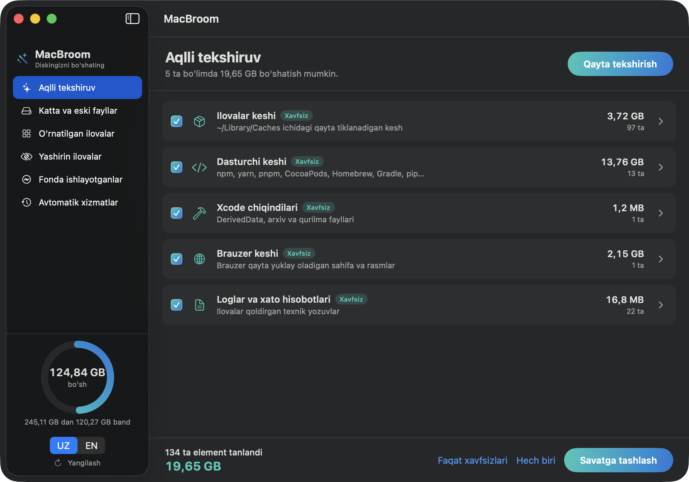

# MacBroom

**Mac uchun bepul tozalash dasturi.** Kesh va keraksiz fayllarni topadi, ilovalarni
qoldiqlari bilan o'chiradi, diskni nima band qilganini xaritada ko'rsatadi.

CleanMyMac qiladigan ishlarning asosiy qismini qiladi, lekin **pullik emas**,
reklama ko'rsatmaydi va **internetga umuman chiqmaydi** — dasturda tarmoq kodi yo'q.

Swift + SwiftUI. Bironta ham tashqi kutubxona ishlatmaydi. Hajmi 3,8 MB.
Interfeys **o'zbekcha va inglizcha**, bir tugma bilan almashadi.

🇬🇧 [English](README.en.md) · 📖 [Batafsil qo'llanma](document.md)



---

## Mundarija

- [Nima qila oladi](#nima-qila-oladi)
- [O'rnatish](#ornatish)
- [Birinchi ochish](#birinchi-ochish)
- [Bo'limlar](#bolimlar)
- [Tavsiya belgilari](#tavsiya-belgilari)
- [Xavfsizlik](#xavfsizlik)
- [Terminal rejimi](#terminal-rejimi)
- [Savollar](#savollar)
- [Loyihaga hissa qo'shish](#loyihaga-hissa-qoshish)
- [Litsenziya](#litsenziya)

---

## Nima qila oladi

| Bo'lim                    | Nima qiladi                                                                                           |
| ------------------------- | ----------------------------------------------------------------------------------------------------- |
| **Aqlli tekshiruv**       | Kesh, log, dasturchi chiqindilari, Savat, eski o'rnatuvchi fayllarni topadi va bir bosishda tozalaydi |
| **Disk xaritasi**         | Papkalarni hajmiga yarasha katak qilib chizadi — joy qayerga ketganini bir qarashda ko'rsatadi        |
| **Katta va eski fayllar** | Istalgan papkani kezib, belgilangan hajmdan katta fayllarni topadi (yashirin papkalar ham)            |
| **Loyihalar**             | `node_modules`, `build`, `Pods`, `.gradle` — loyiha bo'yicha guruhlab, qanday qaytishini yozib beradi |
| **O'rnatilgan ilovalar**  | Barcha ilovalar ro'yxati; ilovani `~/Library` dagi qoldiqlari bilan birga o'chiradi                   |
| **Yashirin ilovalar**     | Menyu satridagi yordamchilar va odatdagi joydan tashqarida o'rnatilganlar                             |
| **Fonda ishlayotganlar**  | Hozir ishlayotgan dasturlar, xotira bo'yicha saralangan, band qilgan portlari bilan                   |
| **Avtomatik xizmatlar**   | Kompyuter yoqilganda o'zi ishga tushadigan dasturlar; keraksizini o'chirasiz                          |

Eng muhimi: **hech narsa butunlay o'chirilmaydi**. Hammasi Savatga tushadi, xato
qilsangiz qaytarib olasiz.

---

## O'rnatish

### Talablar

- **macOS 13 (Ventura)** yoki yangiroq
- **Xcode Command Line Tools** (Swift 5.9+)

Command Line Tools o'rnatilmagan bo'lsa:

```bash
xcode-select --install
```

### Yig'ish

```bash
git clone https://github.com/Abdulloh0109/macBroom.git
cd macBroom
./Scripts/build_app.sh release
open build/MacBroom.app
```

Hammasi shu. Toza clone'dan yig'ilishi **~17 soniya**.

Ikonkani ham yasab olmoqchi bo'lsangiz (ixtiyoriy — `build_app.sh` ikonkasiz ham ishlaydi):

```bash
./Scripts/make_icon.swift .
```

### Doimiy qilib qo'yish

```bash
cp -R build/MacBroom.app /Applications/
```

Yoki Finder'da `build` papkasini ochib, `MacBroom.app` ni `/Applications` ga sudrab tashlang.

---

## Birinchi ochish

Dastur **ad-hoc imzo** bilan yig'ilgan — ya'ni Apple'ga yillik $99 to'lanmagan.
Shuning uchun macOS birinchi ochishda ogohlantirishi mumkin:

> "MacBroom" cannot be opened because the developer cannot be verified.

Yechimi:

1. `MacBroom.app` ga **o'ng tugma** bilan bosing
2. **Open** ni tanlang
3. Chiqqan oynada yana **Open** ni bosing

Bir marta shunday qilsangiz, keyin oddiy ochiladi.

**Tilni almashtirish:** chap ustunning pastida **UZ / EN** tugmasi bor. Bosishingiz
bilan butun interfeys o'zgaradi, dasturni qayta ochish shart emas.

**Ruxsatlar:** `~/Downloads`, `~/Desktop`, `~/Documents` papkalarini macOS himoyalaydi.
Dastur ularni birinchi marta ko'rmoqchi bo'lganda ruxsat so'raydi. Ruxsat bermasangiz
o'sha papkalar shunchaki o'tkazib yuboriladi, boshqa muammo bo'lmaydi.

---

## Bo'limlar

### 1. Aqlli tekshiruv


**Tekshirish** tugmasini bosasiz — dastur quyidagi joylarni ko'rib chiqadi:

| Bo'lim                 | Nimani o'z ichiga oladi                                                             |
| ---------------------- | ----------------------------------------------------------------------------------- |
| Ilovalar keshi         | `~/Library/Caches` — ilovalar o'zi qayta yaratadigan fayllar                        |
| Dasturchi keshi        | npm, yarn, pnpm, Bun, Deno, CocoaPods, Homebrew, pip, Gradle, Cargo, Go, `~/.cache` |
| Xcode chiqindilari     | DerivedData, arxivlar, iOS/watchOS/tvOS qurilma fayllari, simulyator keshi          |
| Brauzer keshi          | Chrome, Safari, Firefox, Brave, Edge, Arc                                           |
| Loglar                 | `~/Library/Logs`, xato hisobotlari                                                  |
| Mail yuklamalari       | Mail ilovasi xatlardan nusxalagan biriktirmalar                                     |
| Savat                  | Savatda turgan fayllar                                                              |
| Eski o'rnatuvchilar    | `~/Downloads` dagi 60 kundan eski `.dmg`, `.pkg`, `.iso`, `.zip`                    |
| iPhone/iPad zaxiralari | Kompyuterdagi zaxira nusxalar                                                       |

Yashil **Xavfsiz** belgisi — bemalol o'chiravering, o'zi qayta yaratiladi.
Sariq **Tekshiring** belgisi — zaxira yoki yuklab olingan fayl bo'lishi mumkin,
shuning uchun dastur ularni **o'zi tanlamaydi**.

Bo'lim yonidagi `>` ni bosib ichida aynan nima borligini ko'rasiz.

### 2. Disk xaritasi


"Disk to'ldi, lekin nima band qilyapti?" — shunga javob beradi. Har bir pufakning
**yuzasi** papkaning hajmiga to'g'ri proporsional: ikki barobar katta papka ikki
barobar katta yuza egallaydi.

- Pufakni **bosing** — ichiga kirasiz, animatsiya bilan
- **Yuqoriga** tugmasi yoki tepadagi yo'l orqali qaytasiz
- **O'ng tugma** — Finder'da ochadi
- Ustiga borsangiz pufak kattalashib, yorishadi

Butun uy papkasi (100 mingdan ortiq fayl) **~20 soniyada** o'lchanadi. Bitta o'tishda
butun daraxt tuziladi, shuning uchun keyin katakdan katakka kirish bir zumda bo'ladi.

### 3. Katta va eski fayllar


Papkani va eng kichik hajmni tanlaysiz, natijalar topilgani sari chiqaveradi.

**Yashirin papkalar ham kiradi** — bu muhim, chunki eng katta fayllar odatda
`~/Documents` da emas, `~/.android` (emulyator obrazlari), `~/.cache`, `~/.docker`
kabi nuqta bilan boshlanadigan papkalarda yotadi.

### 4. Loyihalar


Dasturchi mashinasida eng ko'p joyni `node_modules` egallaydi. Bu bo'lim ularni
barcha loyihalar bo'ylab topib, loyiha bo'yicha guruhlaydi:

| Papka                                              | Qanday qaytadi                    |
| -------------------------------------------------- | --------------------------------- |
| `node_modules`                                     | `npm install`                     |
| `dist`, `build`, `out`, `.next`, `.nuxt`, `.turbo` | `npm run build`                   |
| `Pods`                                             | `pod install`                     |
| `.gradle`                                          | `./gradlew build`                 |
| `target`                                           | `cargo build`                     |
| `.venv`, `venv`, `__pycache__`                     | `pip install -r requirements.txt` |
| `vendor`                                           | `composer install`                |
| `DerivedData`                                      | Xcode qayta yig'adi               |

**Xavfsizlik qoidasi:** papka faqat **yonida loyiha belgisi turgan bo'lsa** hisobga
olinadi — `package.json`, `Cargo.toml`, `Podfile`, `go.mod` kabi fayl. Shuning uchun
`~/Documents/build` degan oddiy papkangiz hech qachon ro'yxatga tushmaydi.

**Faqat 3 oy tegilmaganlari** belgisi — ancha vaqtdan beri ishlatilmagan loyihalarni
qoldiradi, o'chirishga eng arziydiganlari o'shalar.

### 5. O'rnatilgan ilovalar


Barcha ilovalar — hajmi va versiyasi bilan. Ilovani tanlasangiz, u `~/Library` da
qoldirgan hamma narsa chiqadi:

`Application Support` · `Caches` · `Preferences` · `Containers` · `Group Containers`
· `Saved Application State` · `HTTPStorages` · `WebKit` · `Logs` · `Cookies` ·
`LaunchAgents`

Oddiy usulda ilovani Savatga tashlaganingizda bu fayllar **qolib ketadi** va yillar
davomida joy egallab yotadi. **O'chirish** tugmasi hammasini birdaniga tozalaydi.

Har bir faylni alohida belgilash mumkin — ilovani qayta o'rnatmoqchi bo'lsangiz,
sozlamalarini qoldirib ketasiz.

macOS tizim ilovalari qulf belgisi bilan ko'rsatiladi, ularni o'chirib bo'lmaydi.

### 6. Yashirin ilovalar


Dock'da ko'rinmaydigan ilovalar. Ikki xil:

- **Menyu satri** — yuqori o'ng burchakda ishlaydigan yordamchilar (`LSUIElement`)
- **G'ayrioddiy joy** — `/Applications` dan tashqarida o'rnatilganlar

Nima uchun kerak? Bu ilovalar ko'zga tashlanmaydi. Masalan bitta mashinada
**ikkita Docker** topilgan — 4.82.0 va 4.84.0, ikkalasi ham ~2,2 GB. Biri eskirgan
nusxa, oddiy usulda uni hech qachon sezmagan bo'lardingiz.

### 7. Fonda ishlayotganlar


Hozir ishlayotgan dasturlar, eng ko'p xotira yeyayotganidan boshlab.

- **Xotira** raqami Activity Monitor'dagi "Memory" bilan bir xil (`phys_footprint`)
- **Port belgisi** — dastur biror portni band qilgan bo'lsa yashil rangda `5173-port`
  deb yoziladi
- **Yopish** — odatdagidek yopilishni so'raydi (`terminate`, oddiy jarayonlarga
  `SIGTERM`). Majburiy to'xtatish emas, saqlanmagan ish yo'qolmaydi

Muhim jihati: `npm run web`, `node`, `python -m http.server` kabi terminaldan ishga
tushirilgan dasturlar macOS uchun "ilova" hisoblanmaydi va odatdagi ro'yxatlarda
ko'rinmaydi. MacBroom port band qilgan har bir jarayonni alohida qo'shib chiqadi.

### 8. Avtomatik xizmatlar


Kompyuter yoqilganda yoki tizimga kirganingizda o'zi ishga tushadigan dasturlar
(launch agent va daemon'lar).

| Turi                        | Joyi                      | Holati                          |
| --------------------------- | ------------------------- | ------------------------------- |
| **Sizniki**                 | `~/Library/LaunchAgents`  | O'chirish mumkin                |
| **Barcha foydalanuvchilar** | `/Library/Launch*`        | Qulflangan — admin paroli kerak |
| **macOS**                   | `/System/Library/Launch*` | Qulflangan — macOS himoyalagan  |

Yashil nuqta — hozir faol. **O'chirib, Savatga** tugmasi avval `launchctl bootout`
bilan xizmatni to'xtatadi, keyin `.plist` faylini Savatga tashlaydi.

Odatda bu yerda Google Updater, Adobe, Dropbox kabi dasturlarning yangilanish
tekshirgichlari turadi — ular doim fonda ishlab, batareyani yeydi.

---

## Tavsiya belgilari

Dastur "mana shu narsalar bor" deb qo'ya qolmaydi — har birining yoniga nima qilish
kerakligini yozib qo'yadi:

| Belgi                | Ma'nosi                                                         |
| -------------------- | --------------------------------------------------------------- |
| **O'chirish mumkin** | Buni hech kim ishlatmayapti                                     |
| **Ortiqcha**         | Buni ochgan ilova allaqachon yopilgan — birinchi shuni tozalang |
| **Ishlatilmoqda**    | Hozir kerak (masalan port band) — tegmang                       |
| **Tegmang**          | macOS'ga kerak. Yopsangiz ham o'zi qaytadan ishga tushadi       |

**Tegmang** belgisi turgan qatorda _Yopish_ tugmasi umuman bosilmaydi — xato bosib
qo'yishning iloji yo'q.

Aqlli tekshiruvda kesh papkasi yonida sariq **Ilova ochiq** belgisi turishi mumkin —
o'chirsa bo'ladi, lekin ilova keshni darrov qaytadan yozadi, shuning uchun avval
ilovani yopganingiz ma'qul.

---

## Xavfsizlik

Fayl o'chiradigan dasturda eng muhimi shu.

**1. Hech narsa butunlay o'chirilmaydi.** Har bir o'chirish `FileManager.trashItem`
orqali — bu Finder'dagi "Savatga tashlash" bilan aynan bir xil amal. Savatni tozalash
alohida, qo'lda qiladigan ish.

**2. Har bir yo'l qo'riqchidan o'tadi.**
[`SafetyGuard`](Sources/MacBroom/Core/SafetyGuard.swift) tekshiradi:

- faqat uy papkangiz va `/Applications` ichidagi narsalarga ruxsat
- `/`, `/System`, `/Library`, `~/Documents`, `~/Desktop`, `~/.ssh`,
  `~/Library/Caches` (papkaning o'zi) — hech qachon o'chirilmaydi
- eng yuqori darajadagi papkani o'chirish mumkin emas, faqat ichidagilar
- havola (symlink) orqali ruxsat etilgan joydan chiqib ketish rad etiladi

**3. Siz tasdiqlamaguningizcha hech narsa qimirlamaydi.** Ro'yxat va umumiy hajm
ko'rsatiladi, keyin tasdiqlash oynasi chiqadi.

**4. Xavfli bo'limlar oldindan belgilanmaydi.** Zaxira nusxalar va yuklamalar
_Tekshiring_ deb belgilanadi.

**5. Ustma-ust tushgan papkalar ikki marta sanalmaydi.**
`~/Library/Caches/Google/Chrome` va `~/Library/Caches/Google` aks holda ikki marta
hisoblanardi va o'chirishda to'qnashardi.

**6. Bo'sh joy — haqiqiy raqam.** macOS'ning `…ForImportantUsage` API'si "purgeable"
baytlarni ham qo'shib yuboradi va `df` 38 GB deb turgan diskni 122 GB bo'sh deb
ko'rsatadi. MacBroom haqiqiy bo'sh joyni ko'rsatadi, purgeable'ni esa alohida yozadi.

**7. Jarayon va xizmatlarga muomala yumshoq.** `SIGKILL` ishlatilmaydi; xizmat
o'chirilganda `launchctl bootout` qilinadi va faqat `~/Library/LaunchAgents` dagi
fayllarga tegiladi.

Qo'riqchini o'zingiz tekshirib ko'rishingiz mumkin — 31 ta tekshiruv:

```bash
./build/MacBroom.app/Contents/MacOS/MacBroom --selftest
```

---

## Terminal rejimi

Bu rejimda dastur **hech narsa o'chirmaydi**, faqat hisobot beradi:

```bash
MacBroom --scan          # o'zbekcha hisobot
MacBroom --scan --en     # inglizcha
MacBroom --scan --json   # boshqa dastur uchun JSON
MacBroom --map ~         # disk xaritasi, matn ko'rinishida
MacBroom --selftest      # xavfsizlik tekshiruvi
```

Natijasi:

```
  MacBroom — hisobot (hech narsa o'chirilmadi)
  Disk: 245,11 GB dan 207,12 GB band, 37,99 GB bo'sh
  Yana 84,88 GB ni macOS kerak bo'lganda o'zi bo'shatadi
  ──────────────────────────────────────────────────────────────────
  Ilovalar keshi              3,72 GB     97 ta       [Xavfsiz]
      · com.openai.codex — 1,48 GB
  Dasturchi keshi             13,76 GB    13 ta       [Xavfsiz]
      · npm cache — 5,93 GB
      · Homebrew downloads — 3,26 GB
  ──────────────────────────────────────────────────────────────────
  Bo'shatish mumkin: 19,64 GB
```

---

## Savollar

**Qancha joy bo'shaydi?**
Sinov mashinasida birinchi tekshiruvda 19,6 GB chiqdi — ko'p qismi dasturchi keshi
(npm 5,9 GB, Homebrew 3,3 GB). Oddiy foydalanuvchida kamroq, lekin brauzer keshi va
loglar baribir bir necha GB bo'ladi.

**Kesh o'chirilsa biror narsa buziladimi?**
Yo'q. Kesh — ilova tezroq ishlashi uchun saqlab qo'ygan nusxa. O'chirilsa qaytadan
yaratiladi, faqat birinchi ochilish biroz sekinroq bo'ladi.

**Qanchalik tez-tez ishlatish kerak?**
Oyiga bir marta yetadi. Dasturchi bo'lsangiz ikki haftada bir marta.

**Savatni ham o'zi tozalaydimi?**
Yo'q, ataylab. Savatni tozalash orqaga qaytarib bo'lmaydigan amal, shuning uchun uni
Finder orqali o'zingiz qilasiz.

**Internetga chiqadimi?**
Yo'q. Dasturda tarmoq kodi umuman yo'q, tashqi kutubxona ham ishlatilmaydi.

**Yangi tozalash joyi qo'shsam bo'ladimi?**
Ha, bitta qator: [`ScanCatalog.swift`](Sources/MacBroom/Core/ScanCatalog.swift)
faylidagi `rules` ro'yxatiga qo'shasiz:

```swift
.init(category: .devCaches, path: h("Library/Caches/MyTool"), mode: .itself, label: "MyTool keshi"),
```

---

## Loyihaga hissa qo'shish

`main` branch himoyalangan — unga to'g'ridan-to'g'ri push qilib bo'lmaydi.
Har qanday o'zgarish **Pull Request** orqali kiradi:

```bash
git checkout -b fix/nimadir
# o'zgartirasiz
git push -u origin fix/nimadir
gh pr create --fill
```

PR yuborishdan oldin:

```bash
swift build -c release                                    # xatosiz o'tishi kerak
./build/MacBroom.app/Contents/MacOS/MacBroom --selftest    # 31/31 o'tishi kerak
```

Fayl o'chiradigan kodga tegsangiz ikkita qoida buzilmasligi kerak: har bir yo'l
`SafetyGuard` dan o'tsin, va o'chirish faqat Savatga bo'lsin — hech qachon `unlink` emas.

### Kod tuzilishi

```
Sources/MacBroom/
  App/         dastur kirish nuqtasi
  Core/        SafetyGuard, ScanCatalog, SizeCalculator, Cleaner, DiskMap,
               ProjectScanner, SystemInventory, Localization, CLIRunner
  Features/    har bir bo'limning mantiqi (ObservableObject)
  Views/       SwiftUI ko'rinishlari
Scripts/       build_app.sh, make_icon.swift
docs/          skrinshotlar
```

Yangi tarjima qo'shish ham bitta qator:
[`Localization.swift`](Sources/MacBroom/Core/Localization.swift) da ikkala til
yonma-yon turadi, shuning uchun tarjima unutilsa kompilyatsiya xato beradi.

---

## Litsenziya

[MIT](LICENSE) — xohlaganingizni qiling.
